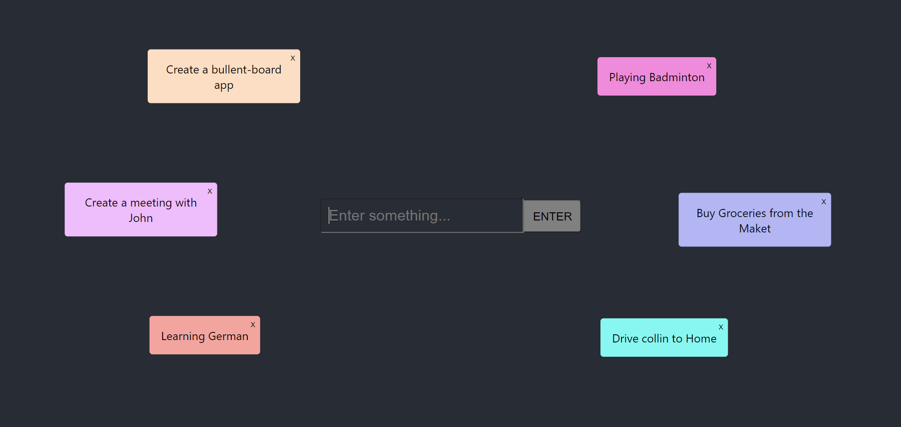

## Bulletin Board

### Description

A simple app to write anything on the board. The notes will be saved to localStorage so don't write anything confidential or private on it. Built for a react draggable tutorial.

Use it for:

- To-do lists
- Grocery lists
- Reading lists
- Brainstorming ideas
- Upcoming appointments
- Quote collection

And many more, be creative with it!

#### Demo: 

### Technologies Used

- [Create React App](https://github.com/facebook/create-react-app).
- [react-draggable](https://github.com/STRML/react-draggable/)
- [randomcolor](https://www.npmjs.com/package/randomcolor)
- [uuid](https://www.npmjs.com/package/uuid)

### Reference

<https://0-lo--victoria-com-0.cdn.ampproject.org/c/s/lo-victoria.com/amp/lets-build-a-simple-bulletin-board-react-app>
